# PROJECT 1 - LAMP STACK IMPLEMENTATION

### CREATING AN AWS ACCOUNT AND SPINNING UP YOUR FIRST LINUX SERVER

- Create an AWS Account
- Create an IAM user with programmatic access
- Create a key pair certificate and download it
- Spin up an ec2 instance
- run `chmod 400` on The key pair downloaded
- Connect to your ec2 instance over the ssh network.

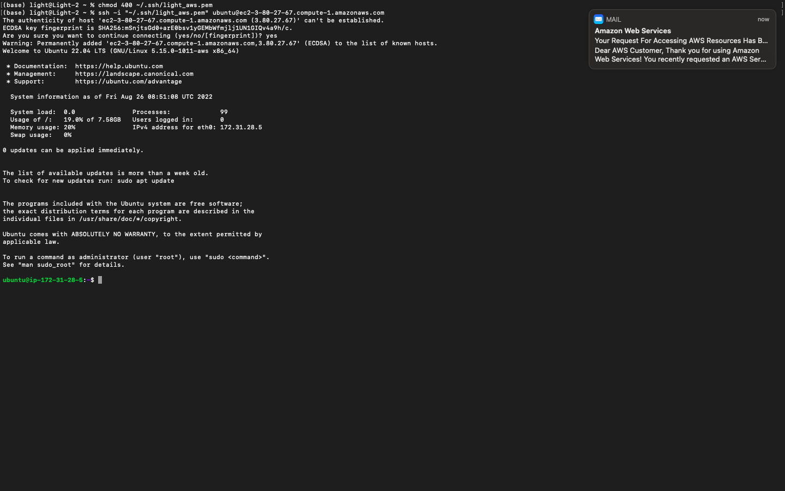

## THE ACTUAL WORK

---

### INSTALLING APACHE AND UPDATING THE FIREWALL

- `sudo apt update` - Always run this command when starting a new server

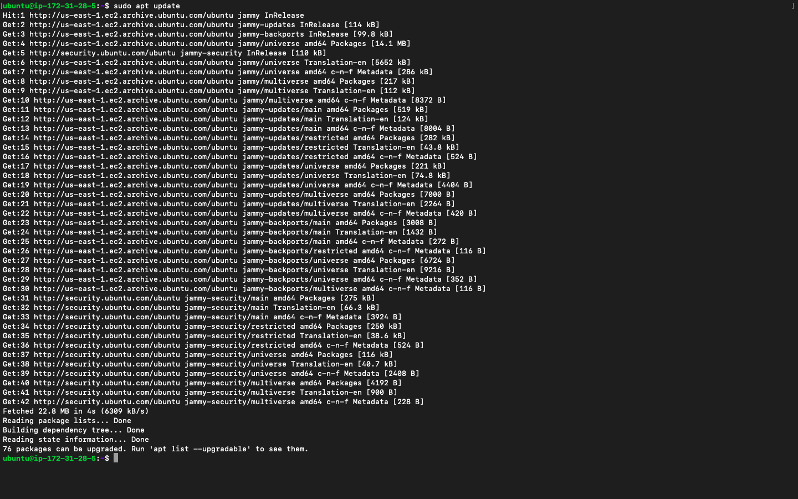

- `sudo apt install apache2` - Install apache on your server

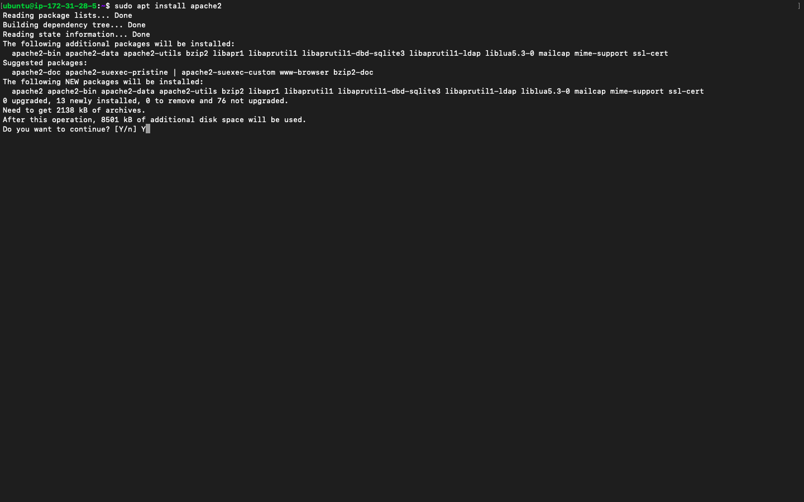

- `sudo systemctl status apache2` - to check if your apache server is running without any errors.

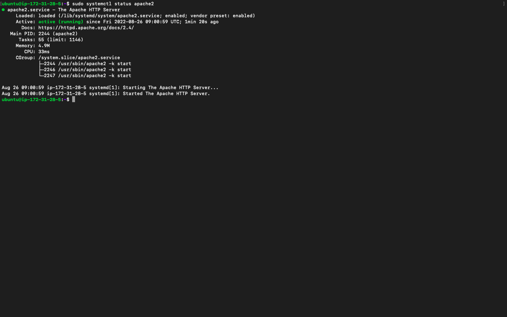

- Try visiting your site using `http://<ip address>:80`

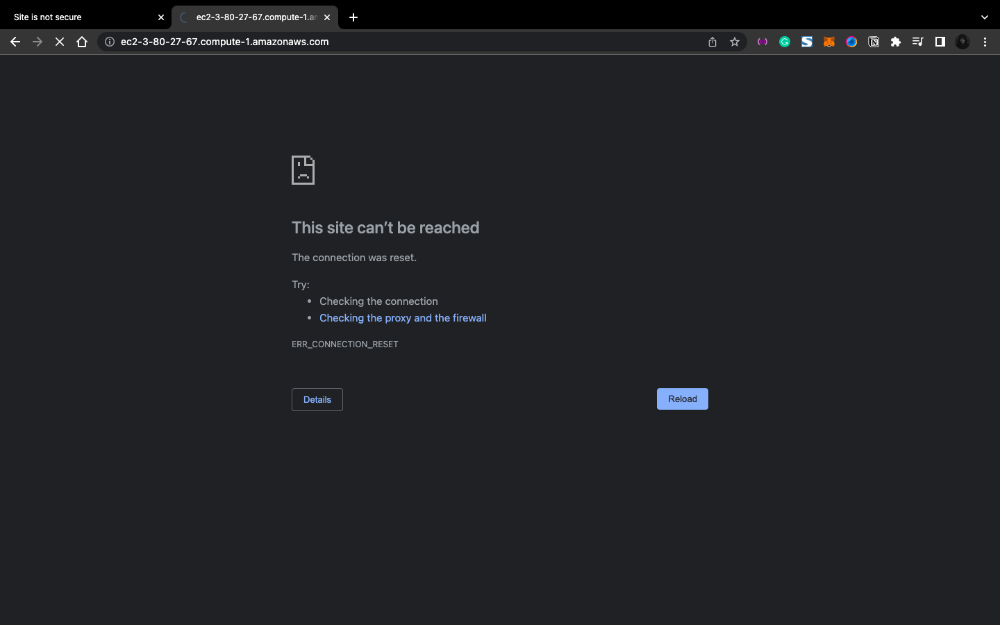

- Site cannot be reached - this is because I have not opened port 80 in my security group (firewall)

### STEPS TO OPEN A NEW PORT IN THE SECURITY GROUPS

- In the sidebar scroll down and find security groups
- Select launch-wizard-1 - which was created when creating the server or the security group attached to the server.
- Select the inbound rules tab and click on edit

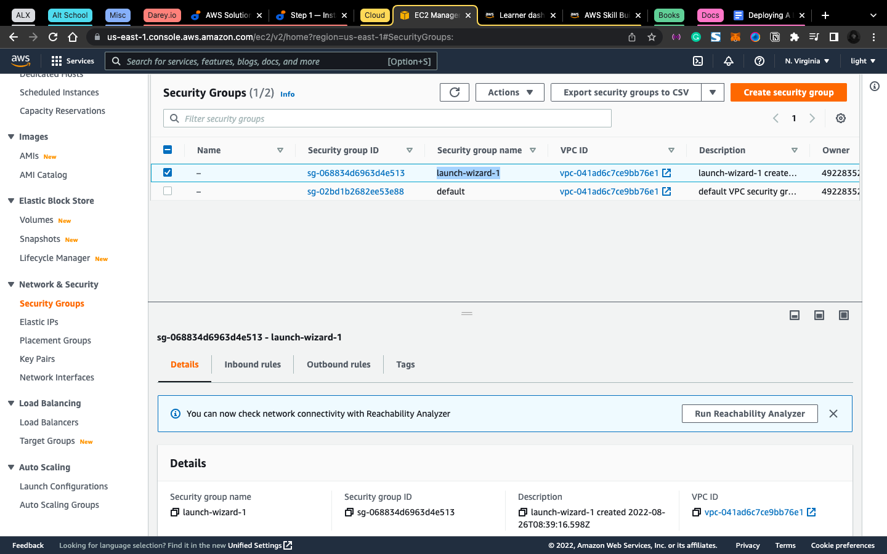

- Click on add rule

- Change custom tcp to http and port to 80
  bv e my first apache server running


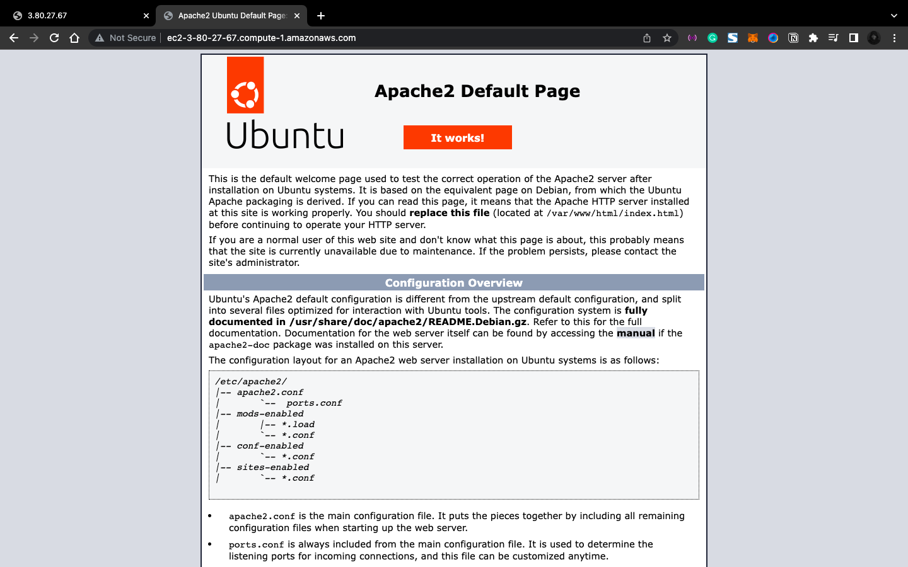

### INSTALLING MYSQL

- sudo apt install mysql-server
  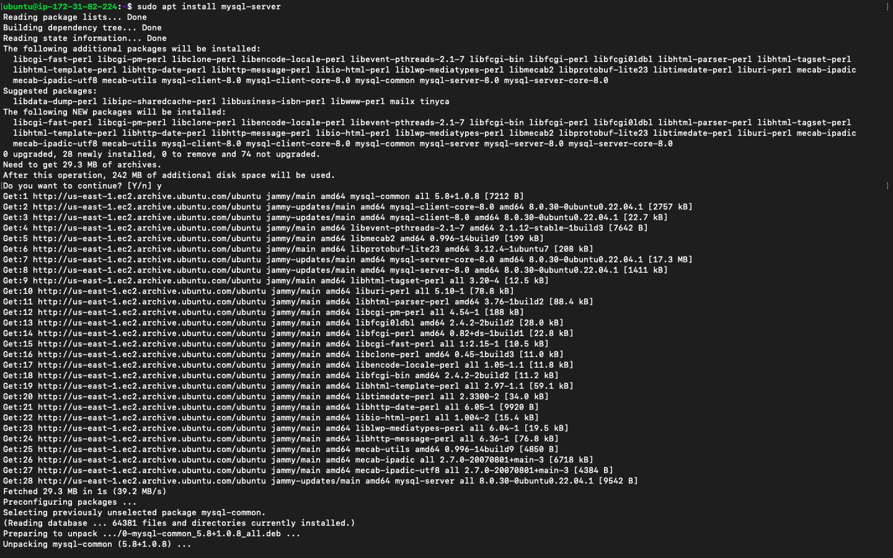

- Sudo mysql
  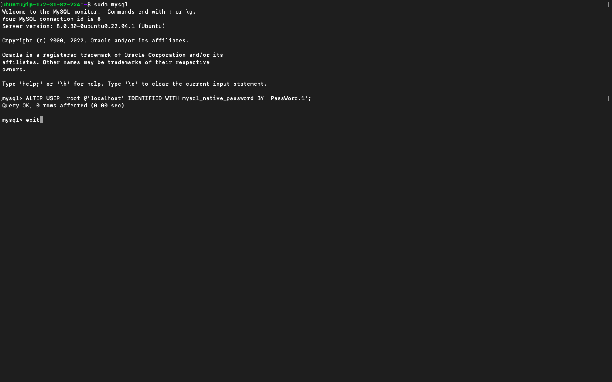

- run `ALTER USER 'root'@'localhost' IDENTIFIED WITH mysql_native_password BY 'PassWord.1';` - This set the password for the root user.

- run `sudo mysql_secure_installation`
  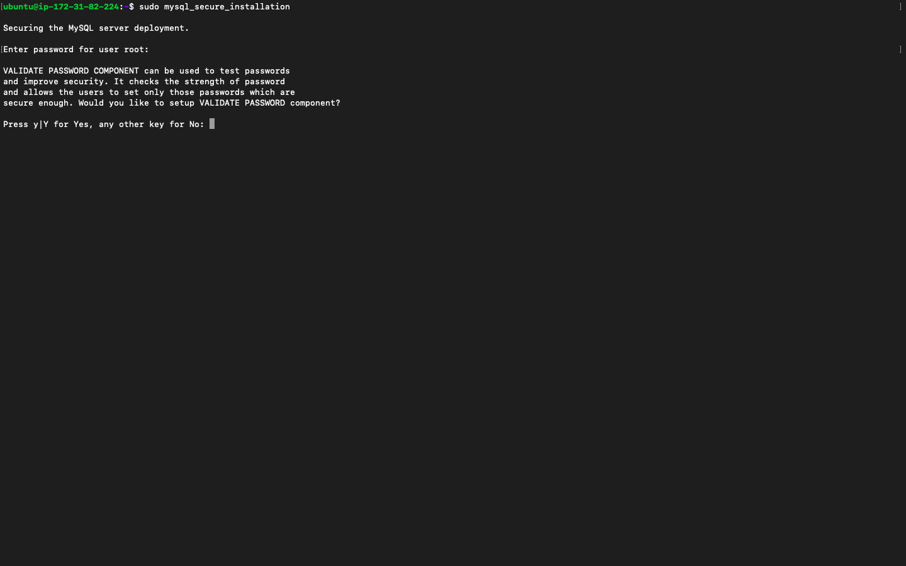

### INSTALLING PHP

- run `sudo apt install php libapache2-mod-php php-mysql`

  - php - display dynamic content

  - hp-mysql - Allow php to communicate with mysql server

  - libapache2-mod-php - will enable apache to handle php files

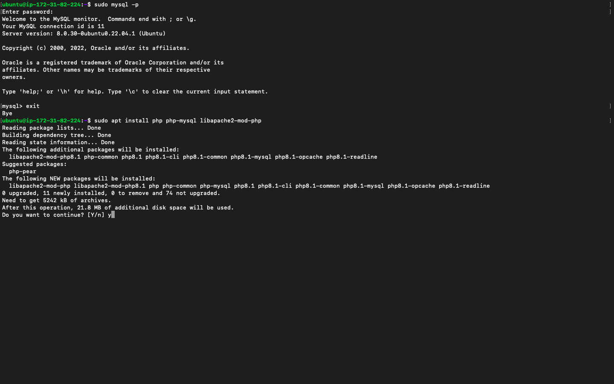

- run `php -v` to checkthe version


### CREATING VIRTUAL HOSTS FOR WEBSITES

- run the following commands

```bash
sudo mkdir /var/www/projectlamp
sudo chown -R $USER:$USER /var/www/projectlamp #assign the ownership of the directory to the current user of the system.
sudo vi /etc/apache2/sites-available/projectlamp.conf
````

- paste this in side the file editor

```conf
<VirtualHost *:80>
    ServerName projectlamp
    ServerAlias www.projectlamp
    ServerAdmin webmaster@localhost
    DocumentRoot /var/www/projectlamp
    ErrorLog ${APACHE_LOG_DIR}/error.log
    CustomLog ${APACHE_LOG_DIR}/access.log combined
</VirtualHost>
```

- Save the file and quit

- run the following commands

```bash
sudo a2ensite projectlamp #to enable the virtualhost created
sudo a2dissite 000-default #to disable the default site
sudo apache2ctl configtest #check syntax error in config files
sudo systemctl reload apache2 #to reload the apache server
```


- But the `/var/www/projectlamp` is empty so we create an html file to display

```bash
sudo echo 'Hello LAMP from hostname' $(curl -s http://169.254.169.254/latest/meta-data/public-hostname) 'with public IP' $(curl -s http://169.254.169.254/latest/meta-data/public-ipv4) > /var/www/projectlamp/index.html
```

### ENABLE PHP ON THE WEBSITE

- run `sudo vim /etc/apache2/mods-enabled/dir.conf`

- Paste in

```conf
<IfModule mod_dir.c>
    #Change this:
    #DirectoryIndex index.html index.cgi index.pl index.php index.xhtml index.htm
    #To this:
    DirectoryIndex index.php index.html index.cgi index.pl index.xhtml index.htm
</IfModule>
```

- run `sudo systemctl reload apache2` - this restarts the apache server


- ` vim /var/www/projectlamp/index.php` - this creates and opens a php file in vim editor

- paste in

```php
<?php
phpinfo();
```

- save changes and close the file

```text
Visit the site again
Congratulation I now have php configured on my server
```

- Once you are done, delete the file content as it contains some sensitive information.

```bash
sudo rm /var/www/projectlamp/index.php
```
